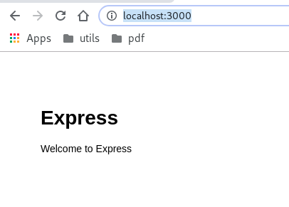

# Express application generator

"The app structure created by the generator is just one of many ways to structure Express apps. 
Feel free to use this structure or modify it to best suit your needs."

http://expressjs.com/en/starter/generator.html

### Gerando

run

    npx express-generator

see

    npx: instalou 10 em 5.929s

      warning: the default view engine will not be jade in future releases
      warning: use `--view=jade' or `--help' for additional options

    destination is not empty, continue? [y/N] y

       create : public/
       create : public/javascripts/
       create : public/images/
       create : public/stylesheets/
       create : public/stylesheets/style.css
       create : routes/
       create : routes/index.js
       create : routes/users.js
       create : views/
       create : views/error.jade
       create : views/index.jade
       create : views/layout.jade
       create : app.js
       create : package.json
       create : bin/
       create : bin/www

       install dependencies:
         $ npm install

       run the app:
         $ DEBUG=express-application-generator:* npm start

### Instalando

    npm install

### Execute

    DEBUG=express-application-generator:* npm start

### Veja resultado

    http://localhost:3000/

